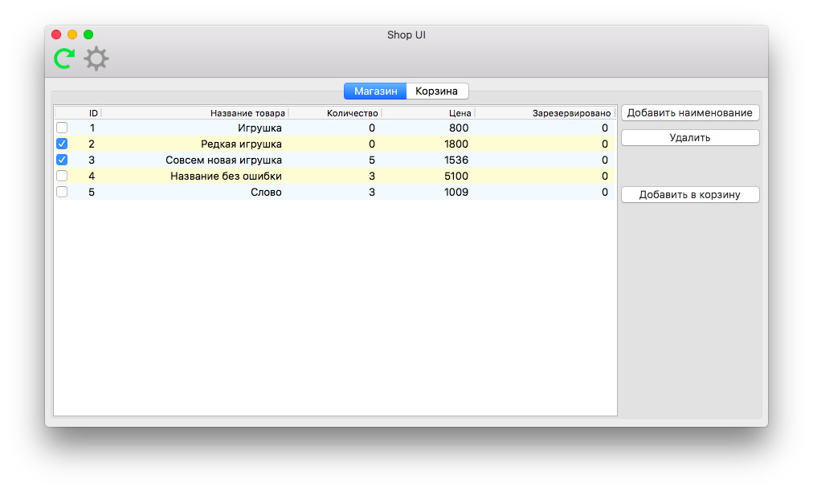
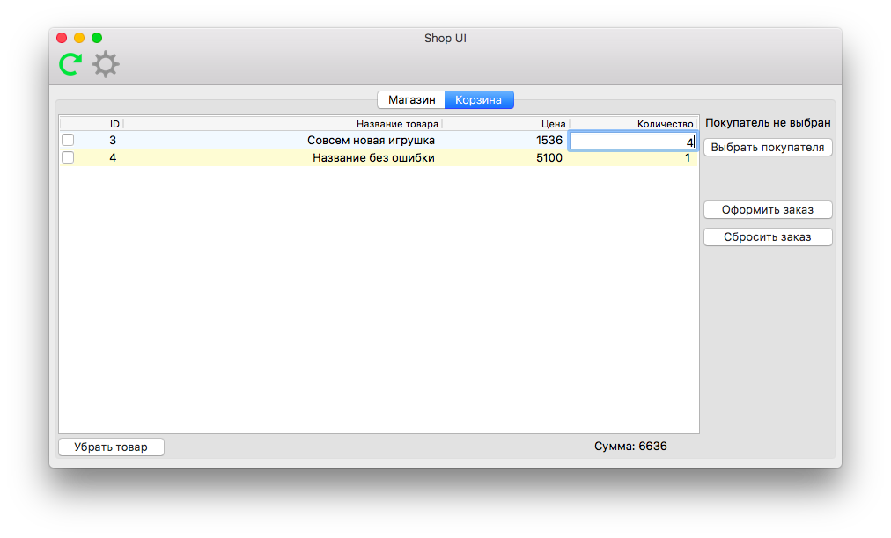
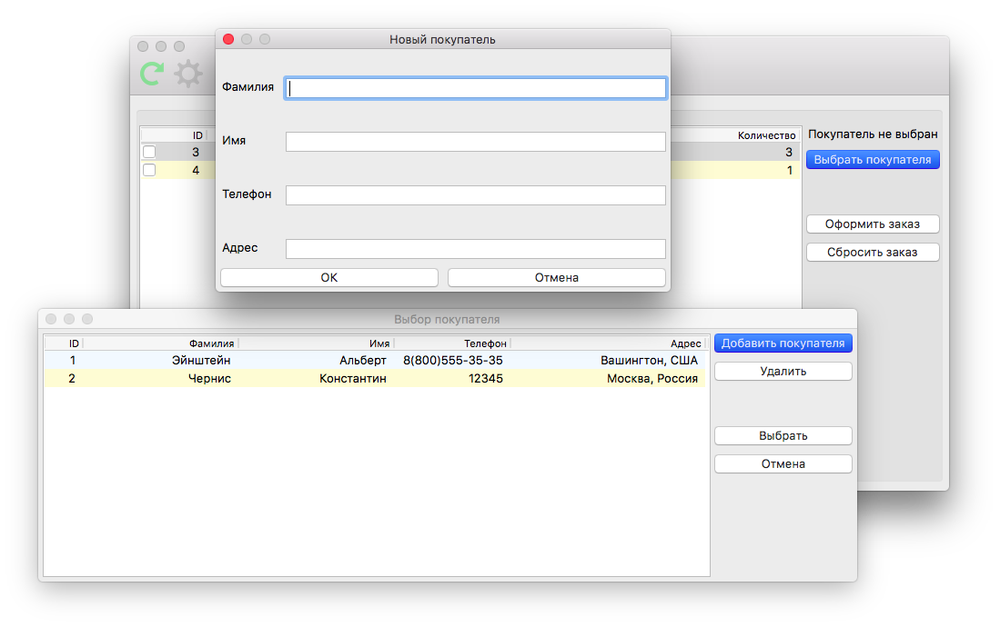

# Shop_Database_UI

A product accounting program for an average shop

## Overview

### Features

* wxPython as frontend
* singleton as a connection between frontend and backend
* universal database manager with plugin support
for different database-management systems
* Exception with enum based error handling system

### Screenshots




## Installation

### Requirements

1. Python 3.6
2. wxPython 4.0.0a3
3. ObjectListView 1.3.1

### ObjectListView fix

Last version of ObjectListView library downloaded from pip
contains several bugs. There is a list of fixes
which are necessary to be done in order to run the program:

1. In `ObjectListView.py` on line 3753:

change this

```python
if not converter and not value:
```

to this

```python
if not converter and value is None:
```

2. In `CellEditor.py` on line 100:

change this

```python
else:
    self.typeToFunctionMap[int] = self._MakeLongEditor
```

to this

```python
else:
    self.typeToFunctionMap[int] = self._MakeIntegerEditor
```

### Startup

Just run `main.py` and enjoy!

## Authors

* **Konstantin Chernis** - *Frontend* - [konarkcher](https://github.com/konarkcher)
* **Vitaliy Ivanin** - *Backend* - [alloky](https://github.com/alloky)
